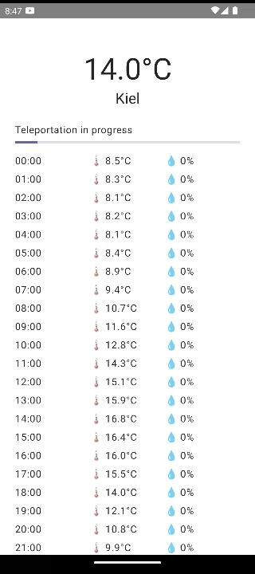

# Teleport-compatible weather forecast app

The journey of this project is shown nicely with commits - they are relatively well split

## The project is structured using Clean Architecture:
### Domain module
Domain module contains use cases, domain models & repository interfaces to be implemented by data module.
The module does not know any details about other modules & could possibly be a plain Kotlin library

### Data module
Data module is responsible for actual fetching and storing of data.
It fields all the clunky details of external APIs, data storage and the like.

### Home module
Home module is focused on the Home screen view. It interacts with Domain use cases for fetching the data.

### Data flow
Data module maps all the different sources of data (like API dtos and database entities) to domain models.
View modules (like Home) can then use the domain models directly or map it further for display.

## Possible improvements:

- Move caching from in-memory implementation to Room
- Display the data in a more pretty way
- I usually also have modules like:
  - `design` for all the common Composable functions
  - `common` for some generic classes & a single `strings.xml` file
  - `navigation` for navigating between modules without cross-dependencies - the project builds faster then
- Use some kind of a navigation library
- Decouple the 10-second ticker progress percentage & index generation
- Add a button to change between metric & imperial units (Just add wiring to switch between ValueFormatters)
- Add more unit tests. Currently only ForecastRepositoryImplTest is tested, but it showcases my BDD (given/when/then) approach
- Refreshing the data in the background could be done with either:
  - ForegroundService (with a persistent notification displaying the current state)
  - WorkManager for populating the Room cache
- Stale cache could still be used:
  - First emit the stale value using a flow from UseCase
  - Then try fetching the new value and emitting that next
- Add Firebase crashlytics, analytics etc.
- Enable Proguard
- Extract strings
- Go full MVI - right now there are no user inputs, so we have a half-MVI
- De-duplicate configuration in modules to make it super easy to create more modules
- Use Vertical Slice Architecture - Clean Architecture, but for each feature. I didn't really use it, but it would look like this:
  - Home module
    - ui module
    - domain module
    - data module
  - Account module
    - ui module
    - domain module
    - data module
